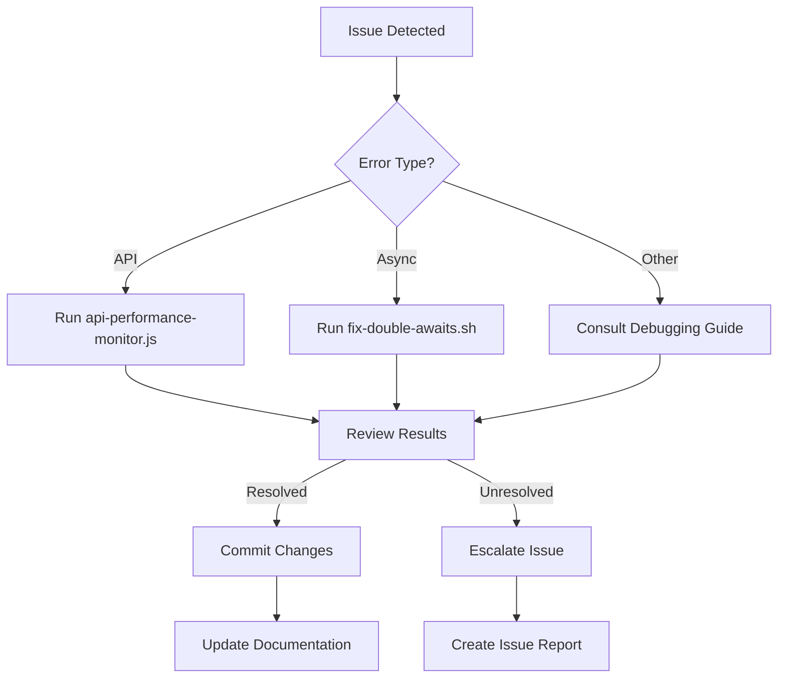

# The Plan: Next.js 15 Migration and Debugging Strategy

## Core Debugging Tools

### 1. Debugging Guide
Reference [@CURSOR-DEBUGGING-GUIDE.md](./CURSOR-DEBUGGING-GUIDE.md) for:
- Error pattern analysis
- Next.js 15 API updates
- Supabase integration debugging
- Search strategies
- Testing procedures

### 2. Performance Monitoring
Use `api-performance-monitor.js` to:
- Test critical API routes
- Monitor response times
- Track success rates
- Generate performance statistics
- Log results for analysis

Configuration:
```bash
# Run performance tests
node scripts/api-performance-monitor.js
```

### 3. Migration Utilities
Use `fix-double-awaits.sh` to:
- Find double await instances
- Automatically fix common async patterns
- Generate backup files
- Report changes made

Usage:
```bash
# Run the fix script
./fix-double-awaits.sh
```

## Workflow Integration

### Pre-Development
1. Review [@migration-plan.md](./migration-plan.md)
2. Set up monitoring tools
3. Configure error tracking
4. Review [@shadcn-guidelines.md](./shadcn-guidelines.md)

### During Development
1. Follow [@commit-rules.md](./commit-rules.md)
2. Run performance tests after API changes
3. Use debugging guide for issue resolution
4. Monitor error patterns

### Pre-Deployment
1. Complete [@pre-deployment-checklist.md](./pre-deployment-checklist.md)
2. Run API performance tests
3. Execute [@lighthouse-testing.md](./lighthouse-testing.md) checks
4. Verify [@auth-testing.md](./auth-testing.md) flows

### Post-Deployment
1. Follow [@deployment-checklist.md](./deployment-checklist.md)
2. Monitor [@performance-results.md](./performance-results.md)
3. Track error rates
4. Monitor API health

## Debug Flow Chart



## Quick Reference

### Common Issues
1. Async API calls
   - Use `fix-double-awaits.sh`
   - Check CURSOR-DEBUGGING-GUIDE.md

2. Performance Issues
   - Run `api-performance-monitor.js`
   - Review performance-results.md

3. Authentication
   - Follow auth-testing.md
   - Check Supabase logs

### Critical Commands
```bash
# Performance monitoring
node scripts/api-performance-monitor.js

# Fix async issues
./fix-double-awaits.sh

# Development with debugging
NODE_OPTIONS=--stack-trace-limit=100 npm run dev

# Test specific routes
curl -v -X GET http://localhost:3000/api/route-name
```

## Folder Structure
```
.cursor/
├── CURSOR-DEBUGGING-GUIDE.md
├── migration-plan.md
├── shadcn-guidelines.md
├── pre-deployment-checklist.md
├── deployment-checklist.md
├── commit-rules.md
├── performance-results.md
├── lighthouse-testing.md
└── auth-testing.md

scripts/
├── api-performance-monitor.js
└── fix-double-awaits.sh
```

## Next Steps
1. Run initial performance baseline tests
2. Execute async pattern fixes
3. Update documentation as needed
4. Monitor error patterns
5. Regular testing cycles

Remember to:
- Always use functional code
- Leverage the Vercel CLI
- Use the Supabase CLI
- Follow Next.js 15 best practices 